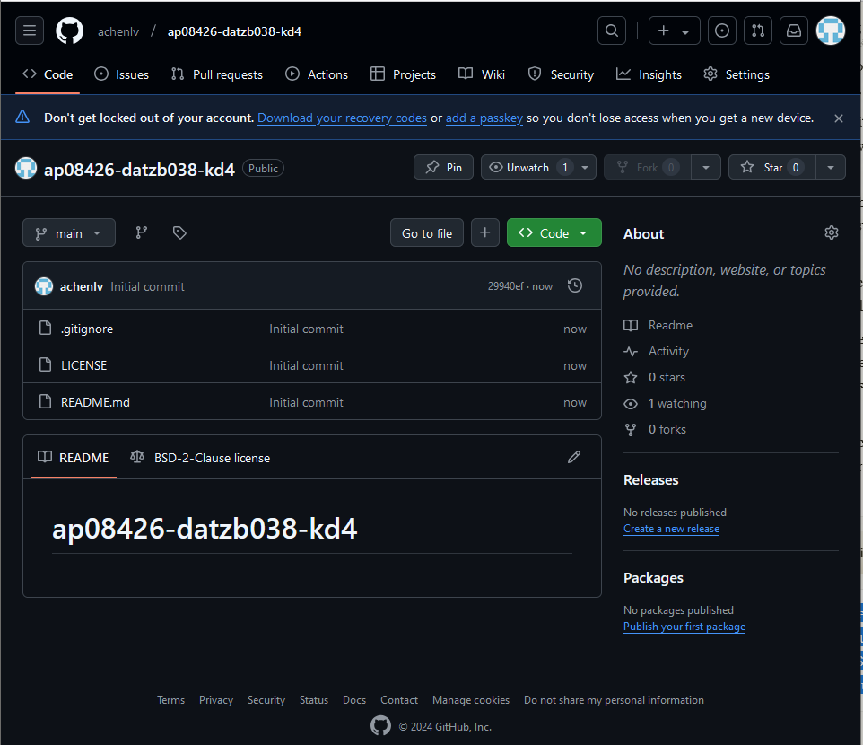
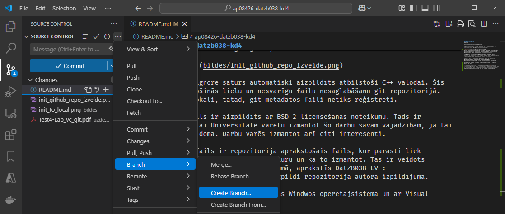
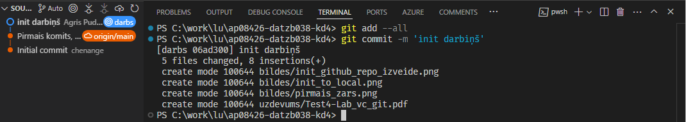
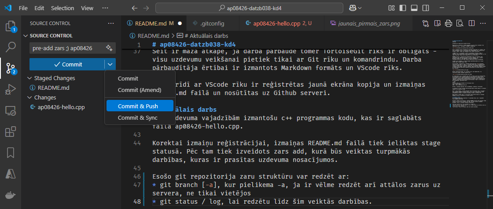
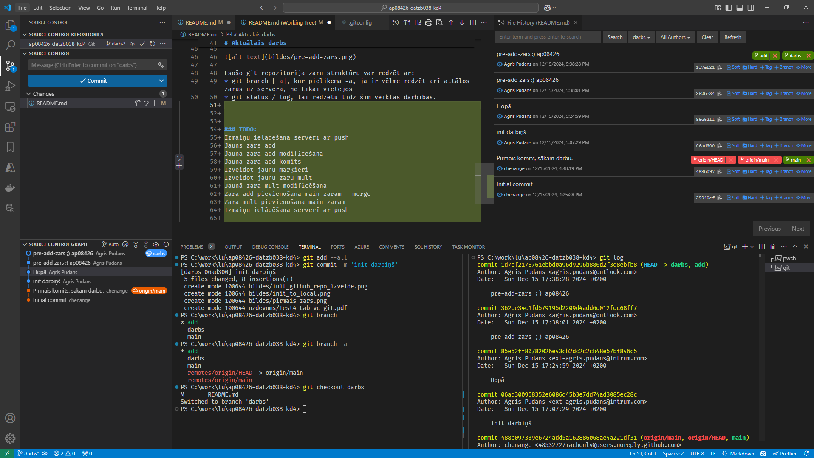
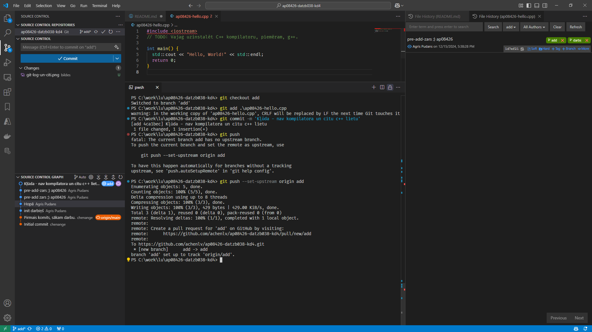
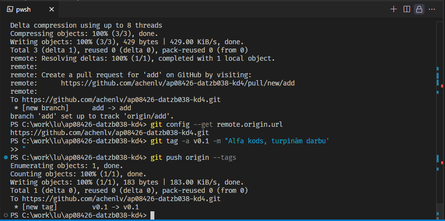

# ap08426-datzb038-kd4
Uzdevumi 

Izveidot git repozitoriju github serverī.  

Repozitorijs izveidots ar vedņa palīdzību, pēc kā uzreiz izveidoti trīs sākotnējie faili - .gitignore, LICENSE un README.md. 



Faila .gitignore saturs automātiski aizpildīts atbilstoši C++ valodai. Šis fails nodrošinās lielu un nesvarīgu failu nesaglabāšanu git repozitorijā. Protams, lokāli, tātad, git metadatos faili netiks reģistrēti. 

LICENSE fails ir aizpildīts ar BSD-2 licensēšanas noteikumu. Tāds ir izvēlēts, lai Universitāte varētu izmantot šo darbu savām vajadzībām, ja tai rodas tāda doma. Darbu varēs izmantot arī citi interesenti. 

README.md fails ir repozitorija aprakstošais fails, kur parasti liek informāciju par repozitorija saturu un kā to izmantot. Tas ir veidots Markdown formātā un, šajā gadījumā, aprakstīs DatZB038-LV : Programminženierija kursa KD4 izpildi repozitorija autora izpildījumā. 

Turpmāk visas darbības ir veiktas Windwos operētājsistēmā un ar Visual Studio Code, turpmāk VScde, rīku. 

Pirmā darbība, neskatoties uz uzdevuma definīcijām pēc [text](uzdevums/Test4-Lab_vc_git.pdf) 2. lapas, ir izveidot darba zara ar nosaukumu darbs izveide. Jaunajā zarā ir pievinoti jauni dati. Ar dažādiem līdzekļiem ir izveidotas divas mapes: bildes un uzdevums. Mapē bildes būs glabātas bildes ar ekrāna kopijām atbilstoši uzdevuma nosacījumiem, bet mapē uzdevums ir pats uzdevums.



Šobrīd izmantojam VScode, lai izveidotu zaru, bet komandrindu, lai reģistrētu veiktās izmaiņas jaunajā zarā.



Uz esošā datora jau ir instalēts Git rīks no https://git-scm.com/downloads, kas nodrošinās visas prasītās darbības un rīks VScode no https://code.visualstudio.com/ ar nepieciešamiem papildinājumiem. Uz darbstacijas jau iepriekš ir nokonfigurēta autentifikācija ar Github serveri izmantojot Git iebūvēto noklusējuma autentifikācijas pārvaldnieku. Tāpat ir konfirgurēti git uzstādījumi .gitconfig failā.
```init
[user]
# Please adapt and uncomment the following lines:
name = Agris Pudans
email = agris.pudans@outlook.com
```
Neredzu  vajadzību papildus rīku uzstādīšanai, piemēram, TortoiseGit. 

Te parādam arī https://github.com/settings/tokens ekrāna kopija ar izveidoto tokenu un tā ievadi Git rīkā.

Šeit ir maza atkāpe, ja darba pārbaudē tomēr TortoiseGit rīks ir obligāts - visu uzdevumu veikšanai pietiek tikai ar Git rīku un komandrindu. Darba pārbaudītāja ērtībai ir izmantots Markdown formāts un VScode rīks.

Šajā brīdī ar VScode rīku ir reģistrētas jaunā ekrāna kopija un izmaiņas README.md failā un nosūtītas uz Github serveri.

# Aktuālais darbs
Git uzdevuma vajadzībām izmantošu c++ programmas kodu, kas ir saglabāts failā ap08426-hello.cpp. 

Korektai izmaiņu reģistrācijai, izmaiņas README.md failā tiek ieliktas stage statusā. Pēc tam tiek izveidots zars add, kurā būs veiktas turpmākās darbības, kuras ir prasītas uzdevuma nosacījumos.



Esošo git repozitorija zaru struktūru var redzēt ar:
* git branch [-a], kur pielikema -a, ja ir vēlme redzēt arī attālos zarus uz servera, ne tikai vietējos
* git status / log, lai redzētu līdz šim veiktās darbības.



Koda izmaiņas darba zarā add. Agrāk izveidotajā vietējā darba zarā add bija fails ap08426-hello.cpp. Mēs saprotam, ka uz esošā datora nav C++ kompilēšanai nepieciešamās programmatūras. Viens no veidiem, kā risināt - aizsūtīt failu uz git serveri. 



Repozitorijā jau ir norādīts attālais git serveris. To var redzēt ar komandu `git config --get remote.origin.url`. Zars add gan pastāv tikai lokālajā kopijā. To var reģistrēt serverī, kā tas ir redzams augstāk pieliktajā bildē.

Git repozitorijā katrai fiksācijai ir savs unikāls id. Ja fiksāciju ir maz, tad vēl var tikt skaidrībā, kas ir kas, jo jāatceras tikai unikālā daļa. Viena fiksācijai noteikti pietitku ar vienu simbolu. Ja fiksāciju ir daudz, tad tikt skaidrībā ar vēsturiskām vietām palīdz marķieri. 



Tagad var izveidot otru repozitoriju mult, kur fiksēs izmaiņas jau no jaunā datora. Protams, var arī no vecā, taču šādi stāsts ir labāks.


Zara add pievienošana main zaram - merge
Zara mult pievienošana main zaram
Izmaiņu ielādēšana serverī ar push
